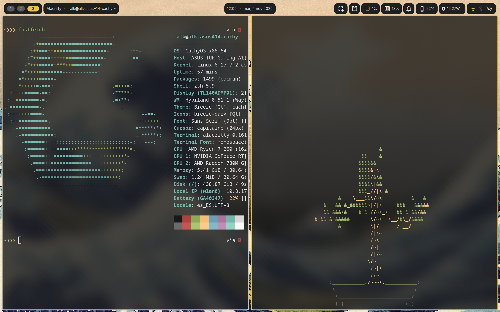

# CachyOS Dotfiles

This repo contains dotfiles to be used with CachyOS, both in laptop and desktop pcs.

## Usage

In [./src](./src/) there are 2 scripts and a json
- [update_repo.sh](./src/update_repo.sh) takes your current dotfiles and copies them to the repo, uses an argument to copy files that are different between desktop and laptop. 
```bash
update_repo.sh [laptop|desktop]
```
- [restore_from_repo.sh](./src/restore_from_repo.sh) restores the dotfiles to its source destination. Uses the same flags as update_repo.sh
```bash
restore_from_repo.sh [laptop|desktop]
```
- [apps.json](./src/apps.json) lists the different apps and dotfiles to restore/update. [schema.json](./src/schema.json) dictates what every entry can and should have.

## Look and feel
|| |
|-|-|
|||
|||

## Requirements
- [dms](https://github.com/AvengeMedia/DankMaterialShell) for the shell
- [matugen](https://github.com/InioX/matugen) for the automated color change
- [hyprland](https://hypr.land/) as the windows manager
- [sddm](https://github.com/sddm/sddm/) as the session manager
- [silentSDDM](https://github.com/uiriansan/SilentSDDM) sddm theme

## Credits
- Some matugen themes are from [matugen themes](https://github.com/InioX/matugen-themes/)
